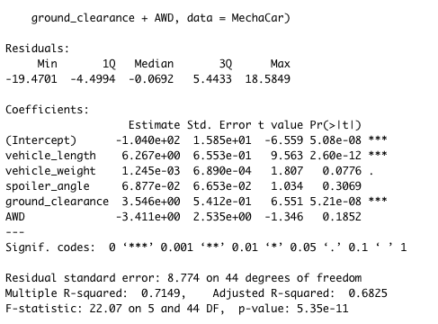
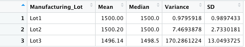
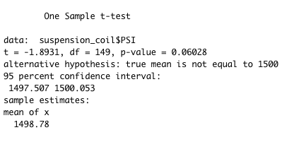
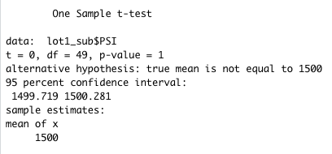
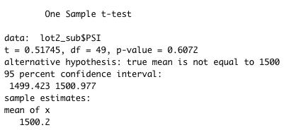
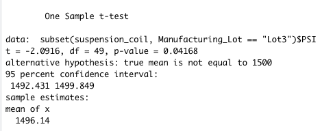

# AutosRUs

## Overview

Many companies rely on statistical data analysis in their decision making processes to produce the best outcome for managing the production of new products.  AutosRUs is an automobile producer and seeks to consider data that will help their manufacturing team overcome production issues for their latest prototype, the MechaCar.  In this analysis, we will explore metrics from the MechaCar to determine likely causes for the road blocks in the product's goal design.  

## Software/Languages

- Software: RStudio

- Languages: R

# Analysis and Results

## Linear Regression to Predict MPG

Initially, the study began by looking for factors that could predict miles per gallon(MPG) using a linear regression model.  There were 6 factors in total, with 5 of the factors being considered as potential predictors of MPG.  

Based on a review of the data, we found:
- Vehicle length, ground clearance, and the intercept are the variables that provided a non-random amount of variance to the MPG values.

- The slope of the linear model is not considered to be zero.  This is because the p-value of the linear model is 5.35e-11, which is much smaller than our standard significance level of .05%.  This means we have sufficient evidence to reject the null hypothesis that the slope is zero. 

- The linear model does predict mpg of MechaCar protypes effectively.  We can see that the Multiple R-Squared value is 71%, which indicates 71% of the variability of our dependent variables can be described using this model.  

## Summary Statistics on Suspension Coils

To evaluate design specifications for the MechaCar, we considered the PSI of suspension coils from a population of MechaCars across three individual lots and the PSI of all manufacturing lots as a whole.  Our objective was to evaluate if the variance of the suspension coils exceeded 100 PSI.  We found:

### Entire Manufacturing Lot Population

- Based on the summary statistics, the mean PSI was 1498.78 across all lots.  In total, the variance was 62.29 PSI.  As a total population, the design specification is met.

### Each Individual Lot

- The variance for the entire population meets design specifications, however the variance is not far removed from the limiting variance.  Our team desides to considered each individual lot, to determine if there is an explanation for the higher variance.  
  - Lot1 has a variance of .979 PSI, which is much smaller than limit variance of 100.  This indicates Lot1 meets the design specifications.
  - Lot2 has a variance of 7.469 PSI, which is smaller than limit variance of 100.  This indicates Lot2 meets the design specifications.
  - Lot3 has a variance of 170.286 PSI, which is much larger than limit variance of 100, and explains why the variance for the entire lot population is large.  This indicates Lot3 does not meet the design specifications.

## T-TESTS on Suspension Coils

To further evaluate PSI of suspension coils, we performed t-tests to determine if all manufacturing lots and each individual lot had statistical differences in PSI. 

### PSI Across All Lots

- Using a t-test, we were able to compare if the PSI across all lots is statistically different from the population mean of 1500.  We found:
  - We must fail to reject our null hypothesis.  This is because our p-value is .06 which is higher than our standard confidence level of .05%.  This would mean there is no statistical difference in the means of a sample of all the lots and the entire manufacturing lot population.

  

### PSI per Lot

- We performed additional t-tests on each lot individually.  We found the following:

  - If we assume a population mean of 1500 PSI for the lot population, we find we must fail to reject our null hypothesis.  This is because of P value is 1, which is higher than our standard confidence level of .05%. With an assumed PSI of 1500 for the entire population, we find no significant difference in the population mean for Lot1. 
  
  
  
  - If we assume a population mean of 1500 PSI for the lot population, we find we must fail to reject our null hypothesis.  This is because of P value is .6072, which is higher than our standard confidence level of .05%. With an assumed PSI of 1500 for the entire population, we find no significant difference in the population mean for Lot2. 
  
  
  
  - If we assume a population mean of 1500 PSI for the lot population, we find we must reject our null hypothesis.  This is because of P value is .0416, which is lower than our standard confidence level of .05%. With an assumed PSI of 1500 for the entire population, we find there is a significant difference in the population mean for Lot3.
  
 

# Study Design: MechaCar vs Competition

## Testing Consumer Interests

In society today, it is important for car manufacturers to anticipate the needs of consumers.  Many consumers lot for vehicles that offer a variety of utility, technology, and fuel efficiency.  With gas prices on the rise, AutosRUs is anticipating consumers will be considering fuel efficiency when it comes to purchasing a car.  In this analysis, we will design a statistical study that evaluates fuel efficiency of cars from AutosRUs vs it's competitors.

- We begin by selecting the data we wish to evaluate.  For this exercise, we would need two sets of numerical, continuous data: a large population of data that describes the MPG for the MechaCar and a large population of data that describes MPG for a competitor(we will use Dyno's prototype AuraMatic as a comparer).
  - For this our metrics will be the mean of the MPG for a sample population of MechaCars and the mean of the MPG for a sample population of AuraMatics.

- Hypothesis:
  - H-0: Our null hypothesis is the true mean difference between AuraMatic and MechaCars MPG is equal to zero.
  - H-a: Our alternative hypothesis is the true mean difference between AuraMatic and MechaCars is not equal to zero.

- We are comparing the populations of two different datasets, thus we will perform a Two sample t-test to evaluate the means of MPG for AuraMatic and MechaCars.  We will need a representive same of the MPGs of each vehicle.

- From this analysis, MechaCars will be able to determine if there is a difference in the mean MPG of AuraMatics and MechaCars.  From performing a t-test of the two samples, we will be able to determine a probability value, (p-value), that will indicate if there is a statistical difference in the samples of two comparable vehicles. In addition, any factors that impact the MPG, such as those described above in previous tests, could become more important for improving the MPG for AutosRUs's MechaCar.
